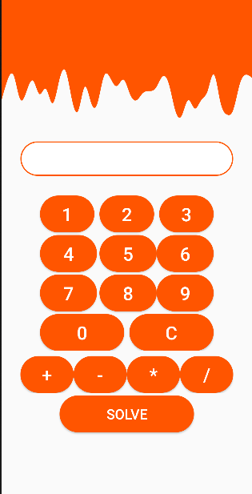

<p align = "center">МИНИСТЕРСТВО НАУКИ И ВЫСШЕГО ОБРАЗОВАНИЯ<br>
РОССИЙСКОЙ ФЕДЕРАЦИИ<br>
ФЕДЕРАЛЬНОЕ ГОСУДАРСТВЕННОЕ БЮДЖЕТНОЕ<br>
ОБРАЗОВАТЕЛЬНОЕ УЧРЕЖДЕНИЕ ВЫСШЕГО ОБРАЗОВАНИЯ<br>
«САХАЛИНСКИЙ ГОСУДАРСТВЕННЫЙ УНИВЕРСИТЕТ»</p>
<br><br><br><br><br><br>
<p align = "center">Институт естественных наук и техносферной безопасности<br>Кафедра информатики<br>Коньков Никита Алексеевич</p>
<br><br><br>
<p align = "center"><br><strong>«Создание простого калькулятора»</strong><br>01.03.02 Прикладная математика и информатика</p>
<br><br><br><br><br><br><br><br><br><br><br><br>
<p align = "right">Научный руководитель<br>
Соболев Евгений Игоревич</p>
<br><br><br>
<p align = "center">г. Южно-Сахалинск<br>2022 г.</p>
<br><br><br><br><br><br><br><br><br><br><br><br>

<h1 align = "center">Введение</h1>

<p><b>Android Studio</b> — интегрированная среда разработки (IDE) для работы с платформой Android, анонсированная 16 мая 2013 года на конференции Google I/O. В последней версии Android Studio поддерживается Android 4.1 и выше.</p>
<p><b>Kotlin</b> — это кроссплатформенный статически типизированный язык программирования общего назначения высокого уровня. Kotlin предназначен для полного взаимодействия с Java, а версия стандартной библиотеки Kotlin для JVM зависит от библиотеки классов Java, но вывод типов позволяет сделать ее синтаксис более кратким. Kotlin в основном нацелен на JVM, но также компилируется в JavaScript (например, для интерфейсных веб-приложений, использующих React) или собственный код через LLVM (например, для собственных приложений iOS, разделяющих бизнес-логику с приложениями Android). Затраты на разработку языка несет JetBrains, а Kotlin Foundation защищает торговую марку Kotlin.</p>

<br>
<h1 align = "center">Цели и задачи</h1>

<h2 align = "center"><b> Калькулятор </b></h2>

<p>Необходимо реализовать простой калькулятор</p>


<h1 align = "center">Решение</h1>

<p>Для выполнения этого задания я воспользовался макетом из лабораторной работы №9</p>

<h2 align = "center">Файл activity_main.xml</h2>

```xml
<?xml version="1.0" encoding="utf-8"?>
<androidx.constraintlayout.widget.ConstraintLayout xmlns:android="http://schemas.android.com/apk/res/android"
    xmlns:app="http://schemas.android.com/apk/res-auto"
    xmlns:tools="http://schemas.android.com/tools"
    android:layout_width="match_parent"
    android:layout_height="match_parent"
    tools:context=".MainActivity">

    <androidx.constraintlayout.widget.ConstraintLayout
        android:id="@+id/question_table"
        android:layout_width="match_parent"
        android:layout_height="100dp"
        android:background="@color/orange"
        android:paddingBottom="16dp"
        app:layout_constraintEnd_toEndOf="parent"
        app:layout_constraintStart_toStartOf="parent"
        app:layout_constraintTop_toTopOf="parent">

    </androidx.constraintlayout.widget.ConstraintLayout>

    <androidx.constraintlayout.widget.ConstraintLayout
        android:id="@+id/wave"
        android:layout_width="match_parent"
        android:layout_height="100dp"
        android:background="@drawable/ic_wave"
        app:layout_constraintEnd_toEndOf="parent"
        app:layout_constraintStart_toStartOf="parent"
        app:layout_constraintTop_toBottomOf="@+id/question_table"></androidx.constraintlayout.widget.ConstraintLayout>

    <androidx.constraintlayout.widget.ConstraintLayout
        android:id="@+id/text_field"
        android:layout_width="0dp"
        android:layout_marginTop="32dp"
        android:layout_marginLeft="32dp"
        android:layout_marginRight="32dp"
        android:layout_height="wrap_content"
        android:background="@drawable/field_shape"
        app:layout_constraintEnd_toEndOf="parent"
        app:layout_constraintStart_toStartOf="parent"
        app:layout_constraintTop_toBottomOf="@id/wave">

        <TextView
            android:id="@+id/text_text"
            android:layout_width="0dp"
            android:layout_marginTop="8dp"
            android:layout_marginBottom="8dp"
            android:layout_height="wrap_content"
            android:layout_marginStart="24dp"
            android:layout_marginEnd="24dp"
            android:background="@android:color/transparent"
            android:textColor="@color/orange"
            android:textColorHint="@color/gray"
            android:textSize="30dp"
            app:layout_constraintBottom_toBottomOf="parent"
            app:layout_constraintEnd_toEndOf="parent"
            app:layout_constraintStart_toStartOf="parent"
            app:layout_constraintTop_toTopOf="parent" />

    </androidx.constraintlayout.widget.ConstraintLayout>

    <androidx.constraintlayout.widget.ConstraintLayout
        android:id="@+id/numbers_field"
        android:layout_width="match_parent"
        android:layout_marginTop="0dp"
        android:layout_marginLeft="32dp"
        android:layout_marginRight="32dp"
        android:layout_height="wrap_content"
        app:layout_constraintEnd_toEndOf="parent"
        app:layout_constraintStart_toStartOf="parent"
        app:layout_constraintTop_toBottomOf="@id/text_field">

        <androidx.appcompat.widget.AppCompatButton
            android:id="@+id/button_one"
            android:text="1"
            android:textColor="#FFFFFF"
            android:textSize="30sp"
            android:layout_width="0dp"
            android:layout_marginTop="32dp"
            android:layout_marginRight="4dp"
            android:layout_marginLeft="32dp"
            android:layout_height="wrap_content"
            android:background="@drawable/button_shape"
            app:layout_constraintEnd_toStartOf="@id/button_two"
            app:layout_constraintStart_toStartOf="parent"
            app:layout_constraintTop_toTopOf="parent"
            />

        <androidx.appcompat.widget.AppCompatButton
            android:id="@+id/button_two"
            android:text="2"
            android:textColor="#FFFFFF"
            android:textSize="30sp"
            android:layout_width="0dp"
            android:layout_marginRight="4dp"
            android:layout_marginLeft="4dp"
            android:layout_marginTop="32dp"
            android:layout_height="wrap_content"
            android:background="@drawable/button_shape"
            app:layout_constraintEnd_toStartOf="@id/button_three"
            app:layout_constraintStart_toEndOf="@id/button_one"
            app:layout_constraintTop_toTopOf="parent"
            />

        <androidx.appcompat.widget.AppCompatButton
            android:id="@+id/button_three"
            android:text="3"
            android:textColor="#FFFFFF"
            android:textSize="30sp"
            android:layout_width="0dp"
            android:layout_marginLeft="4dp"
            android:layout_marginTop="32dp"
            android:layout_marginRight="32dp"
            android:layout_height="wrap_content"
            android:background="@drawable/button_shape"
            app:layout_constraintEnd_toEndOf="parent"
            app:layout_constraintStart_toEndOf="@id/button_two"
            app:layout_constraintTop_toTopOf="parent"
            />

        <androidx.appcompat.widget.AppCompatButton
            android:id="@+id/button_four"
            android:text="4"
            android:textColor="#FFFFFF"
            android:textSize="30sp"
            android:layout_width="0dp"
            android:layout_marginTop="4dp"
            android:layout_marginRight="4dp"
            android:layout_marginLeft="32dp"
            android:layout_height="wrap_content"
            android:background="@drawable/button_shape"
            app:layout_constraintEnd_toStartOf="@id/button_five"
            app:layout_constraintStart_toStartOf="parent"
            app:layout_constraintTop_toBottomOf="@id/button_one"
            />

        <androidx.appcompat.widget.AppCompatButton
            android:id="@+id/button_five"
            android:text="5"
            android:textColor="#FFFFFF"
            android:textSize="30sp"
            android:layout_width="0dp"
            android:layout_marginTop="4dp"
            android:layout_height="wrap_content"
            android:background="@drawable/button_shape"
            app:layout_constraintEnd_toStartOf="@id/button_six"
            app:layout_constraintStart_toEndOf="@id/button_four"
            app:layout_constraintTop_toBottomOf="@id/button_two"
            />

        <androidx.appcompat.widget.AppCompatButton
            android:id="@+id/button_six"
            android:text="6"
            android:textColor="#FFFFFF"
            android:textSize="30sp"
            android:layout_width="0dp"
            android:layout_marginTop="4dp"
            android:layout_marginRight="32dp"
            android:layout_height="wrap_content"
            android:background="@drawable/button_shape"
            app:layout_constraintEnd_toEndOf="parent"
            app:layout_constraintStart_toEndOf="@id/button_five"
            app:layout_constraintTop_toBottomOf="@id/button_three"
            />

        <androidx.appcompat.widget.AppCompatButton
            android:id="@+id/button_seven"
            android:text="7"
            android:textColor="#FFFFFF"
            android:textSize="30sp"
            android:layout_width="0dp"
            android:layout_marginTop="4dp"
            android:layout_marginRight="4dp"
            android:layout_marginLeft="32dp"
            android:layout_height="wrap_content"
            android:background="@drawable/button_shape"
            app:layout_constraintEnd_toStartOf="@id/button_eight"
            app:layout_constraintStart_toStartOf="parent"
            app:layout_constraintTop_toBottomOf="@id/button_four"
            />

        <androidx.appcompat.widget.AppCompatButton
            android:id="@+id/button_eight"
            android:text="8"
            android:textColor="#FFFFFF"
            android:textSize="30sp"
            android:layout_width="0dp"
            android:layout_marginTop="4dp"
            android:layout_height="wrap_content"
            android:background="@drawable/button_shape"
            app:layout_constraintEnd_toStartOf="@id/button_nine"
            app:layout_constraintStart_toEndOf="@id/button_seven"
            app:layout_constraintTop_toBottomOf="@id/button_five"
            />

        <androidx.appcompat.widget.AppCompatButton
            android:id="@+id/button_nine"
            android:text="9"
            android:textColor="#FFFFFF"
            android:textSize="30sp"
            android:layout_width="0dp"
            android:layout_marginTop="4dp"
            android:layout_marginRight="32dp"
            android:layout_height="wrap_content"
            android:background="@drawable/button_shape"
            app:layout_constraintEnd_toEndOf="parent"
            app:layout_constraintStart_toEndOf="@id/button_eight"
            app:layout_constraintTop_toBottomOf="@id/button_six"
            />

        <androidx.appcompat.widget.AppCompatButton
            android:id="@+id/button_zero"
            android:text="0"
            android:textColor="#FFFFFF"
            android:textSize="30sp"
            android:layout_width="0dp"
            android:layout_marginLeft="32dp"
            android:layout_marginRight="4dp"
            android:layout_marginTop="4dp"
            android:layout_height="wrap_content"
            android:background="@drawable/button_shape"
            app:layout_constraintEnd_toStartOf="@id/button_rebuild"
            app:layout_constraintStart_toStartOf="parent"
            app:layout_constraintTop_toBottomOf="@id/button_eight"
            />

        <androidx.appcompat.widget.AppCompatButton
            android:id="@+id/button_rebuild"
            android:text="C"
            android:textColor="#FFFFFF"
            android:textSize="30sp"
            android:layout_width="0dp"
            android:layout_marginLeft="4dp"
            android:layout_marginRight="32dp"
            android:layout_marginTop="4dp"
            android:layout_height="wrap_content"
            android:background="@drawable/button_shape"
            app:layout_constraintEnd_toEndOf="parent"
            app:layout_constraintStart_toEndOf="@id/button_zero"
            app:layout_constraintTop_toBottomOf="@id/button_eight"
            />


    </androidx.constraintlayout.widget.ConstraintLayout>

    <androidx.constraintlayout.widget.ConstraintLayout
        android:id="@+id/buttons_field"
        android:layout_width="match_parent"
        android:layout_marginTop="4dp"
        android:layout_marginLeft="32dp"
        android:layout_marginRight="32dp"
        android:layout_height="wrap_content"
        app:layout_constraintEnd_toEndOf="parent"
        app:layout_constraintStart_toStartOf="parent"
        app:layout_constraintTop_toBottomOf="@id/numbers_field">

        <androidx.appcompat.widget.AppCompatButton
            android:id="@+id/button_plus"
            android:text="+"
            android:textColor="#FFFFFF"
            android:textSize="30sp"
            android:layout_width="0dp"
            android:layout_marginTop="4dp"
            android:layout_height="wrap_content"
            android:background="@drawable/button_shape"
            app:layout_constraintEnd_toStartOf="@id/button_minus"
            app:layout_constraintStart_toStartOf="parent"
            app:layout_constraintTop_toTopOf="parent"
            />

        <androidx.appcompat.widget.AppCompatButton
            android:id="@+id/button_minus"
            android:text="-"
            android:textColor="#FFFFFF"
            android:textSize="30sp"
            android:layout_width="0dp"
            android:layout_marginTop="4dp"
            android:layout_height="wrap_content"
            android:background="@drawable/button_shape"
            app:layout_constraintEnd_toStartOf="@id/button_multiply"
            app:layout_constraintStart_toEndOf="@id/button_plus"
            app:layout_constraintTop_toTopOf="parent"
            />

        <androidx.appcompat.widget.AppCompatButton
            android:id="@+id/button_multiply"
            android:text="*"
            android:textColor="#FFFFFF"
            android:textSize="30sp"
            android:layout_width="0dp"
            android:layout_marginTop="4dp"
            android:layout_height="wrap_content"
            android:background="@drawable/button_shape"
            app:layout_constraintEnd_toStartOf="@id/button_div"
            app:layout_constraintStart_toEndOf="@id/button_minus"
            app:layout_constraintTop_toTopOf="parent"
            />

        <androidx.appcompat.widget.AppCompatButton
            android:id="@+id/button_div"
            android:text="/"
            android:textColor="#FFFFFF"
            android:textSize="30sp"
            android:layout_width="0dp"
            android:layout_marginTop="4dp"
            android:layout_height="wrap_content"
            android:background="@drawable/button_shape"
            app:layout_constraintEnd_toEndOf="parent"
            app:layout_constraintStart_toEndOf="@id/button_multiply"
            app:layout_constraintTop_toTopOf="parent"
            />


    </androidx.constraintlayout.widget.ConstraintLayout>

    <androidx.appcompat.widget.AppCompatButton
        android:id="@+id/button_solve"
        android:text="@string/solve_button"
        android:textColor="#FFFFFF"
        android:textSize="23sp"
        android:layout_width="0dp"
        android:layout_marginTop="4dp"
        android:layout_marginLeft="96dp"
        android:layout_marginRight="96dp"
        android:layout_height="wrap_content"
        android:background="@drawable/button_shape"
        app:layout_constraintEnd_toEndOf="parent"
        app:layout_constraintStart_toStartOf="parent"
        app:layout_constraintTop_toBottomOf="@id/buttons_field"
        />


</androidx.constraintlayout.widget.ConstraintLayout>
```

<h2 align = "center">Файл MainActivity.kt</h2>

```kotlin
package com.bignerdranch.android.calc

import androidx.appcompat.app.AppCompatActivity
import android.os.Bundle
import android.widget.EditText
import android.widget.TextView

class MainActivity : AppCompatActivity() {

    private lateinit var textView: TextView
    private lateinit var oneButton: androidx.appcompat.widget.AppCompatButton
    private lateinit var twoButton: androidx.appcompat.widget.AppCompatButton
    private lateinit var threeButton: androidx.appcompat.widget.AppCompatButton
    private lateinit var fourButton: androidx.appcompat.widget.AppCompatButton
    private lateinit var fiveButton: androidx.appcompat.widget.AppCompatButton
    private lateinit var sixButton: androidx.appcompat.widget.AppCompatButton
    private lateinit var sevenButton: androidx.appcompat.widget.AppCompatButton
    private lateinit var eightButton: androidx.appcompat.widget.AppCompatButton
    private lateinit var nineButton: androidx.appcompat.widget.AppCompatButton
    private lateinit var zeroButton: androidx.appcompat.widget.AppCompatButton
    private lateinit var plusButton: androidx.appcompat.widget.AppCompatButton
    private lateinit var minusButton: androidx.appcompat.widget.AppCompatButton
    private lateinit var multiplyButton: androidx.appcompat.widget.AppCompatButton
    private lateinit var divButton: androidx.appcompat.widget.AppCompatButton
    private lateinit var solveButton: androidx.appcompat.widget.AppCompatButton
    private lateinit var rebuildButton: androidx.appcompat.widget.AppCompatButton

    private var result = 0
    private var first_number = 0
    private var second_number = 0
    private var solve_index = 0

    override fun onCreate(savedInstanceState: Bundle?) {
        super.onCreate(savedInstanceState)
        setContentView(R.layout.activity_main)

        rebuildButton = findViewById(R.id.button_rebuild)
        textView = findViewById(R.id.text_text)
        oneButton = findViewById(R.id.button_one)
        twoButton = findViewById(R.id.button_two)
        threeButton = findViewById(R.id.button_three)
        fourButton = findViewById(R.id.button_four)
        fiveButton = findViewById(R.id.button_five)
        sixButton = findViewById(R.id.button_six)
        sevenButton = findViewById(R.id.button_seven)
        eightButton = findViewById(R.id.button_eight)
        nineButton = findViewById(R.id.button_nine)
        zeroButton = findViewById(R.id.button_zero)
        plusButton = findViewById(R.id.button_plus)
        minusButton = findViewById(R.id.button_minus)
        multiplyButton = findViewById(R.id.button_multiply)
        divButton = findViewById(R.id.button_div)
        solveButton = findViewById(R.id.button_solve)

        oneButton.setOnClickListener{
            textView.text = if(textView.text == "0") "1" else {textView.text.toString() + "1"}
        }

        twoButton.setOnClickListener{
            textView.text = if(textView.text == "0") "2" else {textView.text.toString() + "2"}
        }

        threeButton.setOnClickListener{
            textView.text = if(textView.text == "0") "3" else {textView.text.toString() + "3"}
        }

        fourButton.setOnClickListener{
            textView.text = if(textView.text == "0") "4" else {textView.text.toString() + "4"}
        }

        fiveButton.setOnClickListener{
            textView.text = if(textView.text == "0") "5" else {textView.text.toString() + "5"}
        }

        sixButton.setOnClickListener{
            textView.text = if(textView.text == "0") "6" else {textView.text.toString() + "6"}
        }

        sevenButton.setOnClickListener{
            textView.text = if(textView.text == "0") "7" else {textView.text.toString() + "7"}
        }

        eightButton.setOnClickListener{
            textView.text = if(textView.text == "0") "8" else {textView.text.toString() + "8"}
        }

        nineButton.setOnClickListener{
            textView.text = if(textView.text == "0") "9" else {textView.text.toString() + "9"}
        }

        zeroButton.setOnClickListener{
            textView.text = if(textView.text == "0") "0" else {textView.text.toString() + "0"}
        }

        plusButton.setOnClickListener {
            first_number = textView.text.toString().toInt()
            textView.text = "0"
            solve_index = 1
        }

        minusButton.setOnClickListener {
            first_number = textView.text.toString().toInt()
            textView.text = "0"
            solve_index = 2
        }

        multiplyButton.setOnClickListener {
            first_number = textView.text.toString().toInt()
            textView.text = "0"
            solve_index = 3
        }

        divButton.setOnClickListener {
            first_number = textView.text.toString().toInt()
            textView.text = "0"
            solve_index = 4
        }

        solveButton.setOnClickListener{
            second_number = textView.text.toString().toInt()
            when(solve_index){
                1 -> {
                    result = first_number + second_number
                }
                2 -> {
                    result = first_number - second_number
                }
                3 -> {
                    result = first_number * second_number
                }
                4 -> {
                    result = first_number / second_number
                }
                else -> {
                    //nothing
                }
            }

            textView.text = result.toString()
            first_number = result
        }

        rebuildButton.setOnClickListener{
            first_number = 0
            second_number = 0
            result = 0
            solve_index = 0
            textView.text = first_number.toString()
        }
    }
}
```

<h2 align = "center">Результат работы</h2>

<p align = "center"></p>


<h1 align = "center">Вывод</h1>
<p>По итогу проделанной лабораторной работы, я реализовал простой калькулятор и закрепил знания по ConstraintLayout</p>